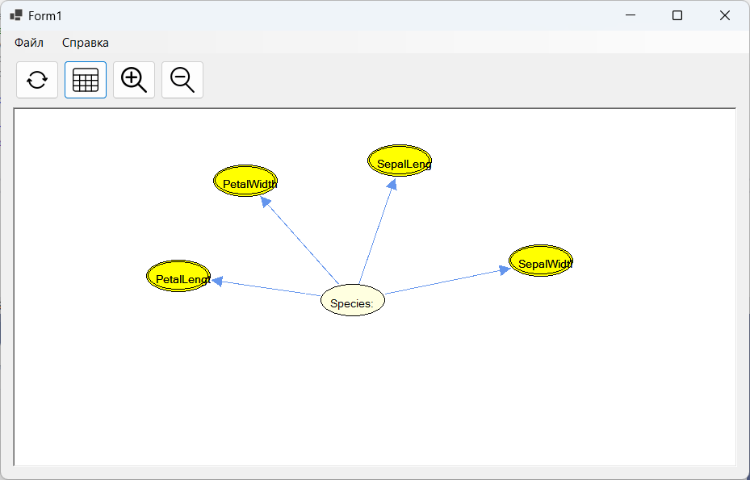

# GUIHugin

В проекте производиться подключение Hugin API к технологии NET Framework.

Выполнено построение графического интерфейса с помощью платформы пользовательского интерфейса Windows Forms. Разработанное приложение позволяет создавать, читать, визуализировать и проверять домен.

