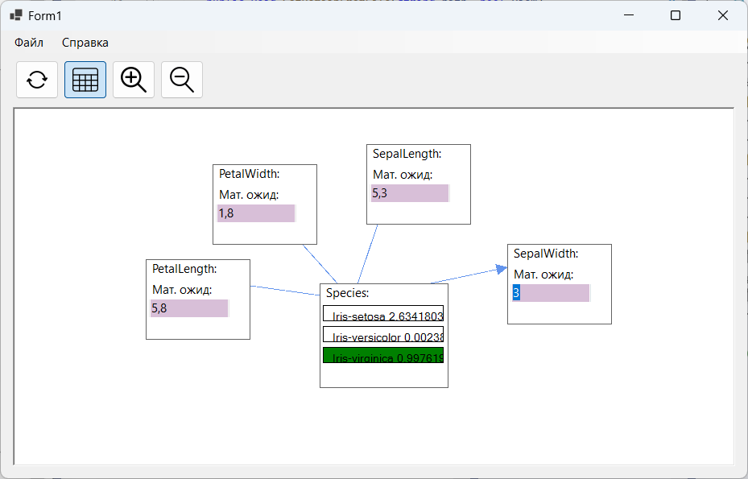

# GUIHugin

В проекте производиться подключение Hugin API к технологии NET Framework.

Выполнено построение графического интерфейса с помощью платформы пользовательского интерфейса Windows Forms. Разработанное приложение позволяет создавать, читать, визуализировать и проверять домен.

<figure class = "one">
	
	<figcaption>Режим отображения сети</figcaption>
</figure>
<figure class = "two">
	
	<figcaption>Режим ввода свидетельств</figcaption>
</figure>
